# Round 2 Question Summary

## Data basis

- ABC thresholds: A≤0.80, B≤0.95
- XYZ CV thresholds: X≤0.50, Y≤1.00
- Low-sample XYZ rule: min nonzero weeks = 4
- Missing shipment rows excluded: 0 (0.00% of rows)

## Q1.1 Demand pattern classification
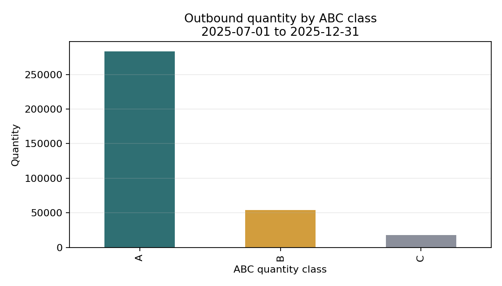

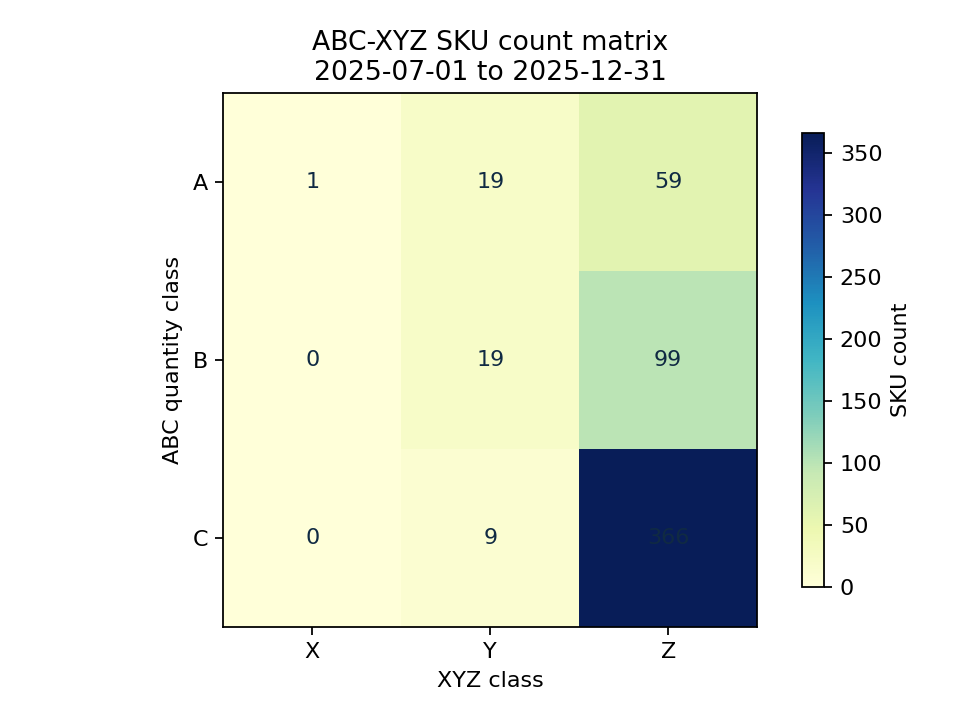

## Q1.2 Demand geography with ambiguity-safe matching
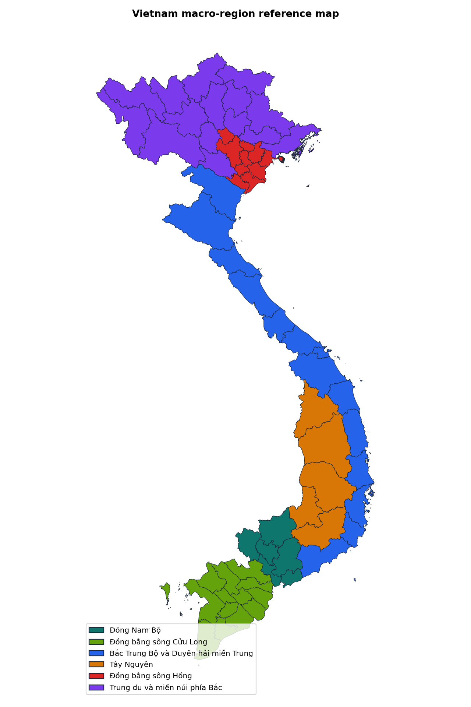

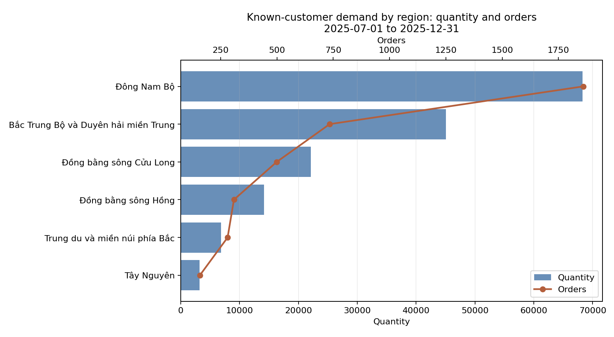

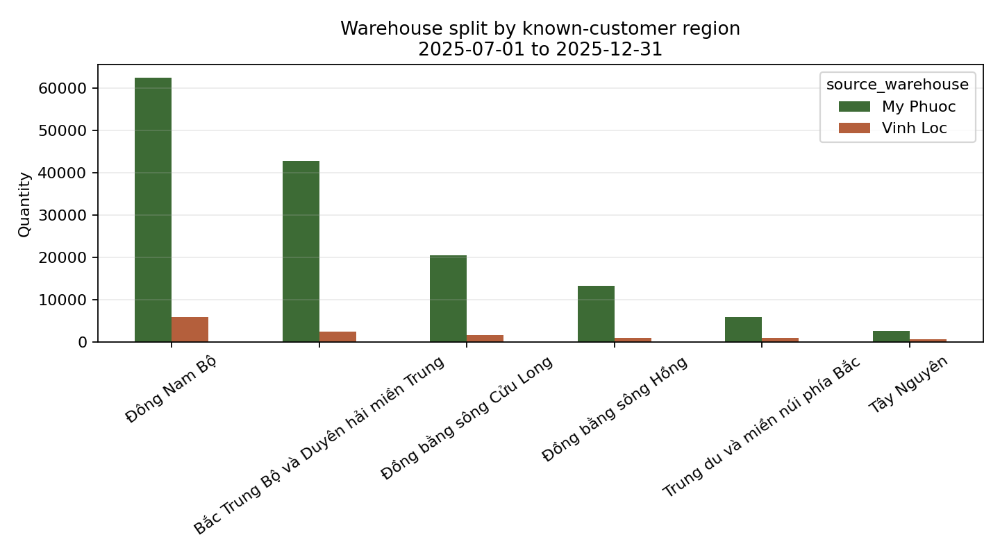

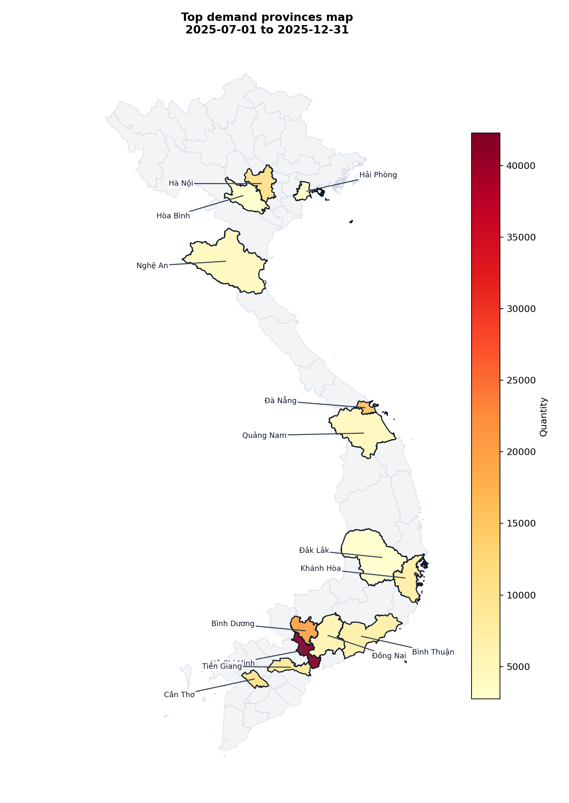

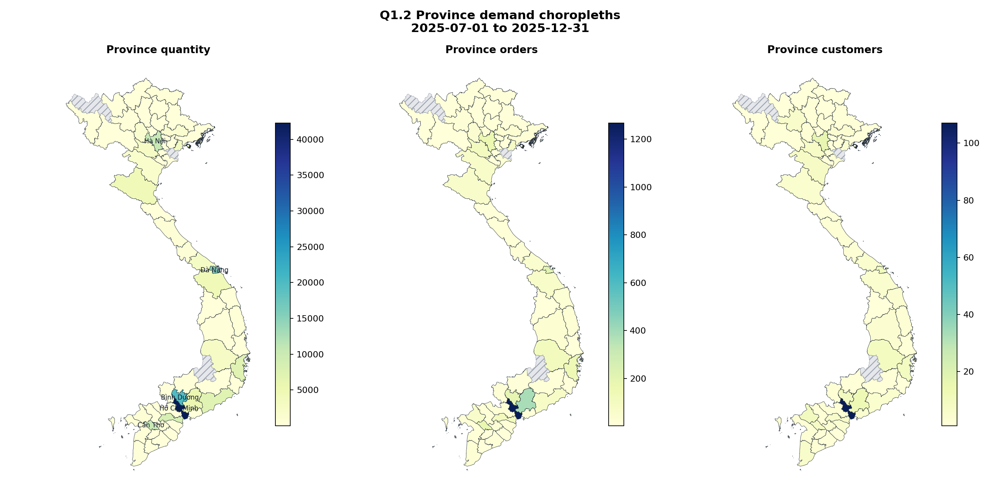

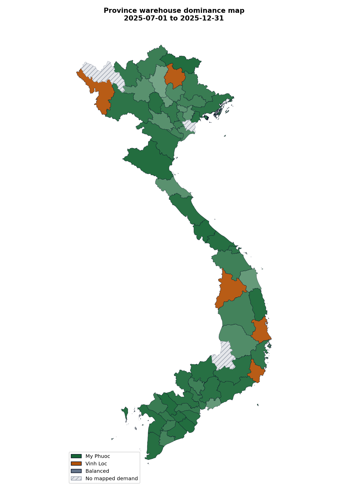

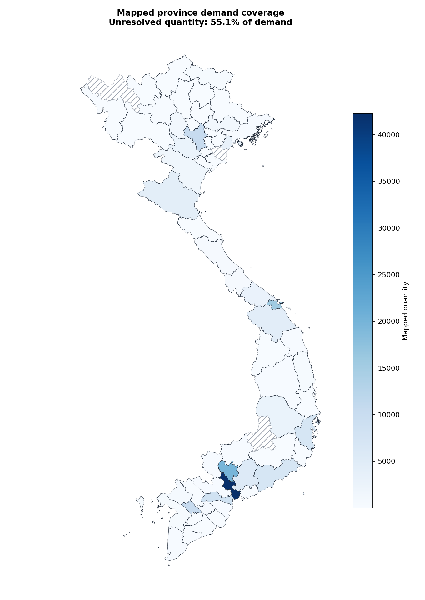

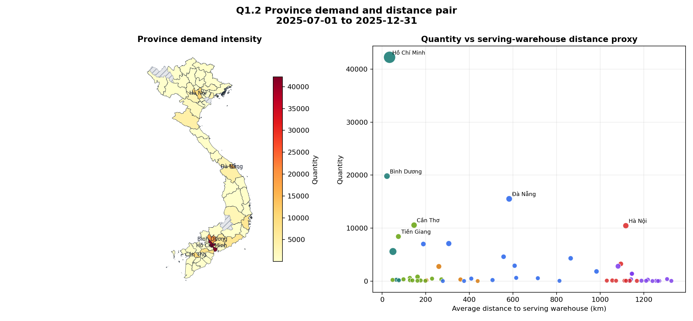

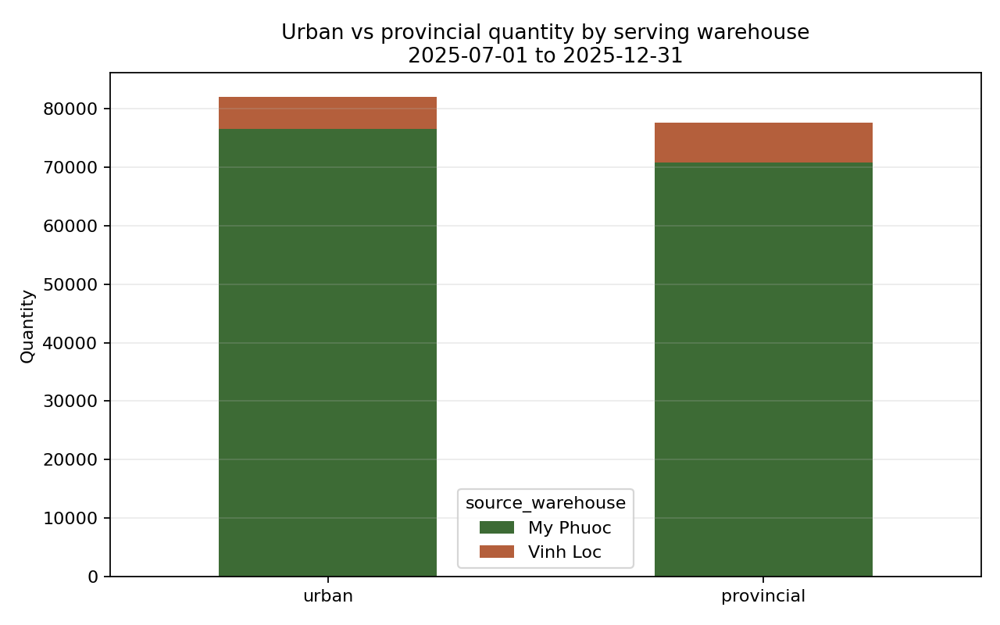

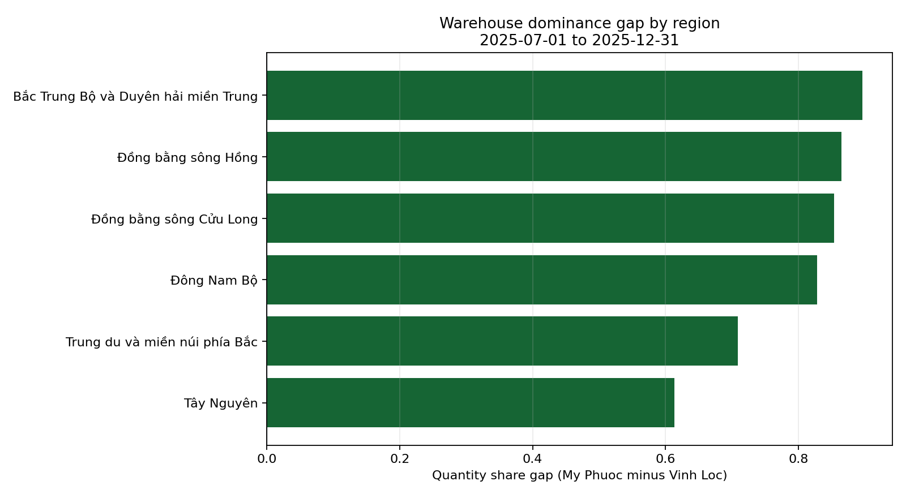

## Q1.3 Order profile analysis
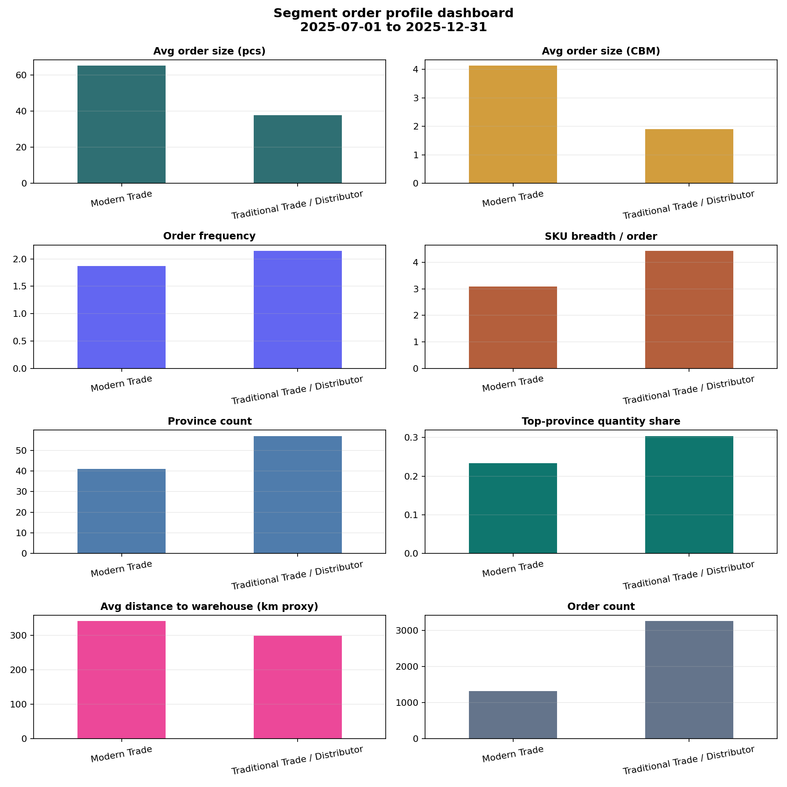

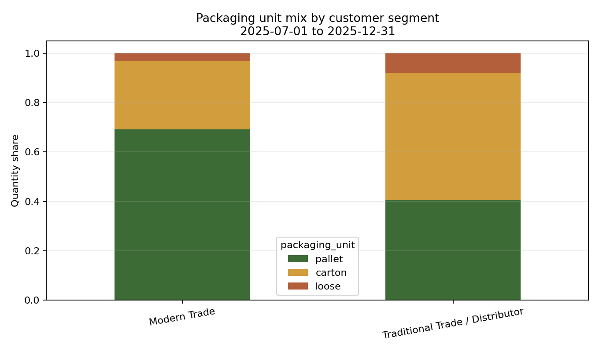

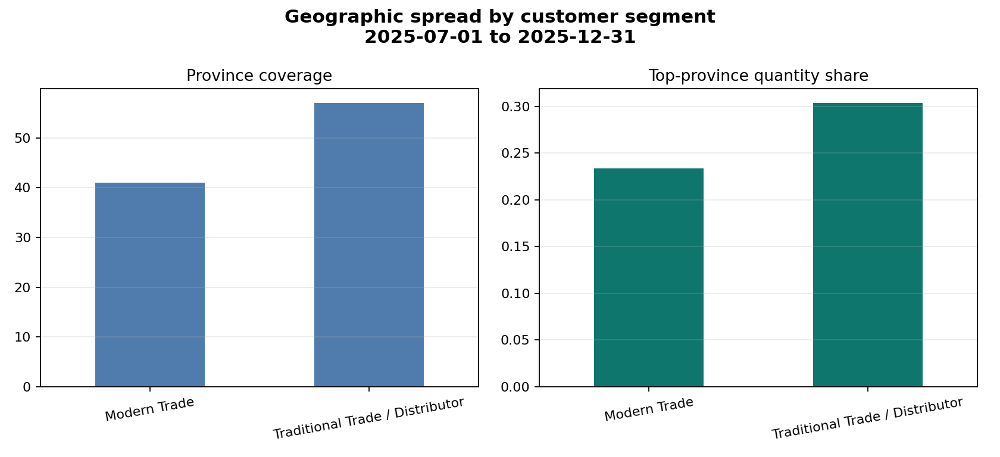

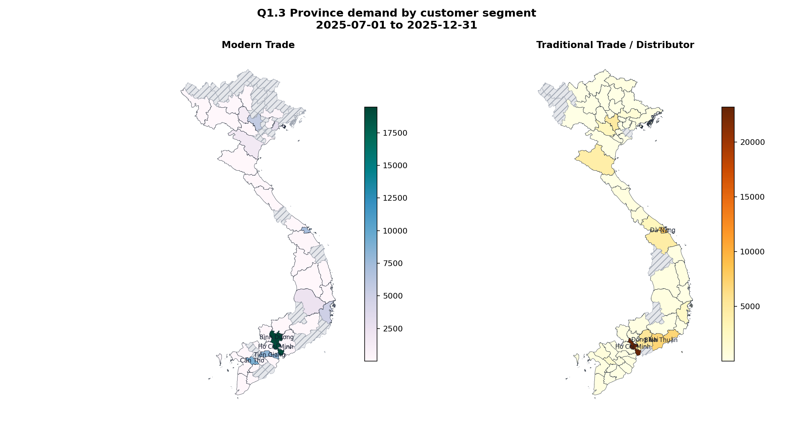
